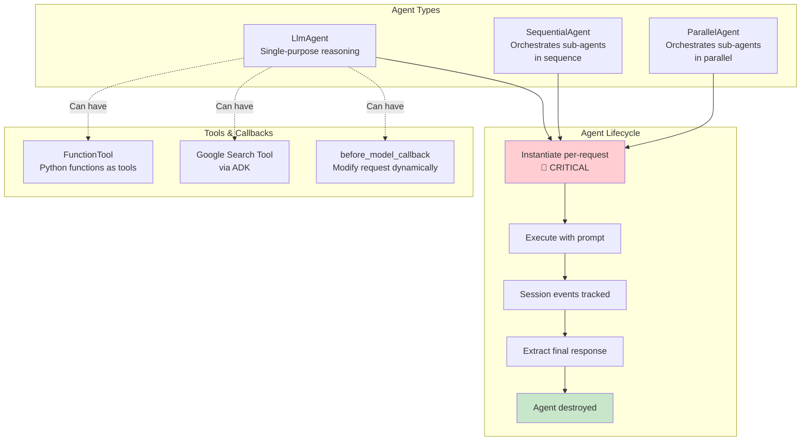
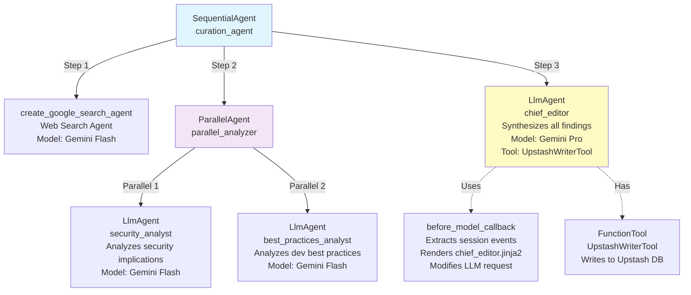
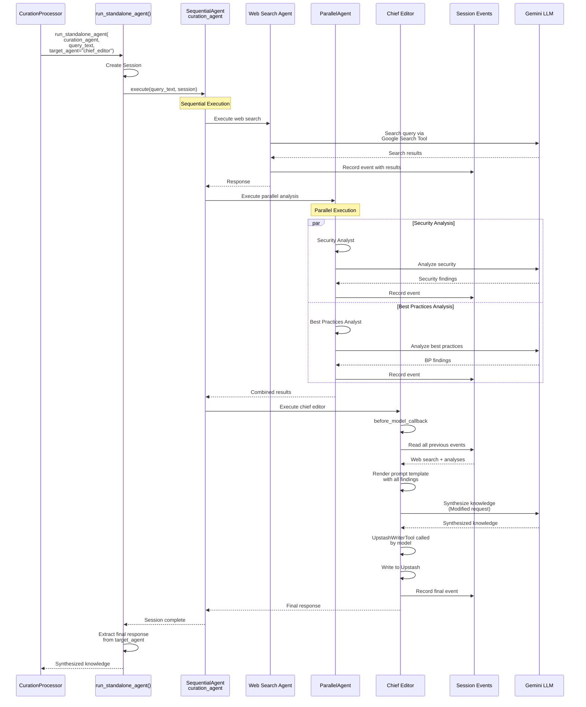
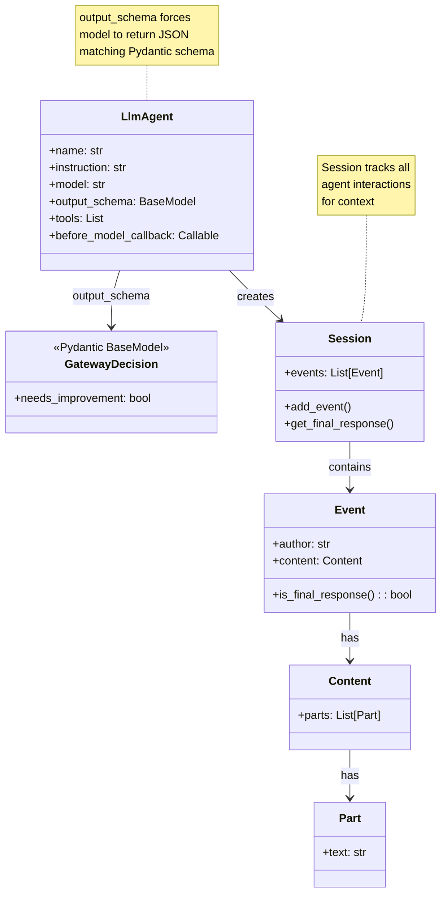
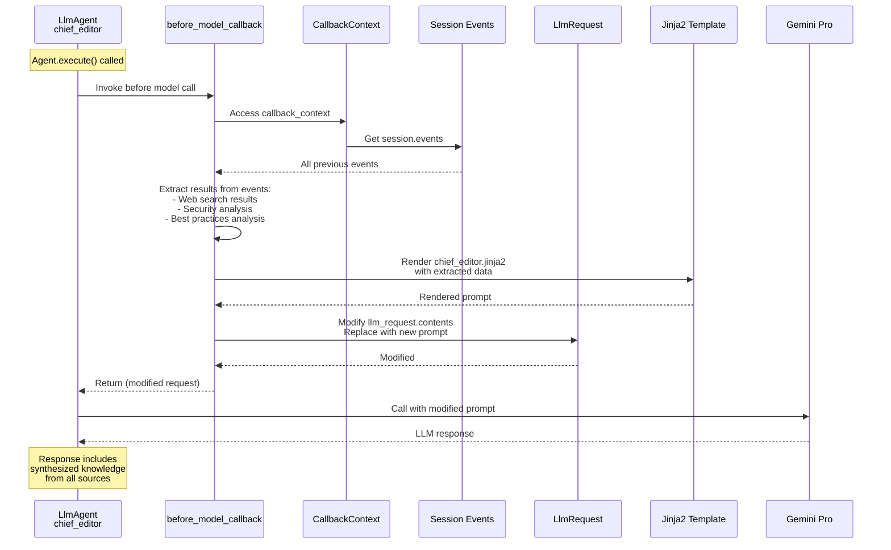

# Agent Orchestration Diagrams

## Multi-Agent System Overview



## Curation Agent Hierarchy



## Agent Execution Flow - SequentialAgent



## KnowledgeGatewayProcessor Agent Pattern

```mermaid
flowchart TD
    START([KnowledgeGatewayProcessor<br/>.process called])
    
    DATA[Receive data:<br/>query_text<br/>public_results]
    
    SANITIZE[Sanitize public results<br/>Remove / and newlines]
    
    INST[🔴 INSTANTIATE AGENT<br/>Per-Request!<br/>LlmAgent with<br/>GatewayDecision schema]
    
    PROMPT[Render prompt:<br/>knowledge_gateway.jinja2<br/>with query + context]
    
    RUN[run_standalone_agent(<br/>gateway_agent, prompt)]
    
    SESSION[Agent creates session]
    MODEL[Call Gemini Flash]
    STRUCT[Return structured JSON<br/>per GatewayDecision schema]
    
    PARSE{Valid JSON?}
    
    VALIDATE[Parse with Pydantic:<br/>GatewayDecision.model_validate_json]
    
    FALLBACK[Fallback parsing:<br/>Check for 'true' or<br/>'NEEDS_IMPROVEMENT']
    
    RESULT[decision: bool]
    
    UPDATE[Update data:<br/>data['needs_improvement'] = decision]
    
    RETURN([Return data])
    
    START --> DATA
    DATA --> SANITIZE
    SANITIZE --> INST
    
    Note1[Why per-request?<br/>Prevents session state<br/>from previous requests<br/>bleeding into current one]
    INST -.-> Note1
    
    INST --> PROMPT
    PROMPT --> RUN
    RUN --> SESSION
    SESSION --> MODEL
    MODEL --> STRUCT
    STRUCT --> PARSE
    
    PARSE -->|Yes| VALIDATE
    PARSE -->|No| FALLBACK
    
    VALIDATE --> RESULT
    FALLBACK --> RESULT
    
    RESULT --> UPDATE
    UPDATE --> RETURN
    
    style INST fill:#ffcdd2
    style Note1 fill:#fff9c4
```

## Structured Output Pattern



## Agent Session State Bug (Fixed)

```mermaid
sequenceDiagram
    participant Req1 as Request 1
    participant Bad as ❌ BAD: Agent in __init__
    participant Req2 as Request 2
    participant Good as ✅ GOOD: Agent per-request
    participant Req3 as Request 3
    
    Note over Bad: Agent created once<br/>in processor __init__
    
    Req1->>Bad: process(data1)
    Bad->>Bad: Agent has session1
    Bad->>Bad: Session1: "Python security"
    Bad-->>Req1: Response with context
    
    Req2->>Bad: process(data2)
    Bad->>Bad: REUSES SAME AGENT!
    Bad->>Bad: Session still has:<br/>"Python security" + new data
    Bad-->>Req2: ❌ WRONG: Context leaked!
    
    Note over Good: Agent created fresh<br/>in each .process() call
    
    Req1->>Good: process(data1)
    Good->>Good: Create new agent
    Good->>Good: Fresh session: "Python security"
    Good->>Good: Destroy agent
    Good-->>Req1: Response
    
    Req3->>Good: process(data2)
    Good->>Good: Create new agent
    Good->>Good: Fresh session: "JavaScript testing"
    Good->>Good: Destroy agent
    Good-->>Req3: ✅ CORRECT: No context leak!
    
    style Bad fill:#ffcdd2
    style Good fill:#c8e6c9
```

## Code Fix Pattern

### ❌ BEFORE (Session State Bug)

```python
class KnowledgeGatewayProcessor(Processor):
    def __init__(self, llm_service: LLMService):
        self.llm_service = llm_service
        # ❌ BAD: Agent created once, session persists
        self.gateway_agent = LlmAgent(
            name="knowledge_gateway_agent",
            instruction=self.prompt_manager.render("knowledge_gateway.jinja2"),
            output_schema=GatewayDecision,
            model=self.llm_service.settings.gemini_flash_model,
        )
    
    async def process(self, data: dict, context: dict) -> dict:
        # Agent is reused across requests
        result = await run_standalone_agent(self.gateway_agent, prompt)
        # Previous request's context bleeds into this one!
```

### ✅ AFTER (Fixed)

```python
class KnowledgeGatewayProcessor(Processor):
    def __init__(self, llm_service: LLMService):
        self.llm_service = llm_service
        # ✅ GOOD: No agent instantiation here
    
    async def process(self, data: dict, context: dict) -> dict:
        # ✅ Create fresh agent for each request
        gateway_agent = LlmAgent(
            name="knowledge_gateway_agent",
            instruction=self.prompt_manager.render("knowledge_gateway.jinja2"),
            output_schema=GatewayDecision,
            model=self.llm_service.settings.gemini_flash_model,
        )
        
        result = await run_standalone_agent(gateway_agent, prompt)
        # Agent destroyed after request, no state leakage
```

## Tool Function Pattern

```mermaid
flowchart TD
    START([Define Python Function])
    
    ASYNC[async def UpstashWriterTool<br/>data: str -> str]
    
    DOC[Docstring describes<br/>what tool does<br/>for LLM to understand]
    
    LOGIC[Implement logic:<br/>await upstash_writer.write(data)]
    
    NAME[Set __name__ attribute:<br/>UpstashWriterTool.__name__ = 'write']
    
    WRAP[Wrap in FunctionTool:<br/>FunctionTool(func=UpstashWriterTool)]
    
    ATTACH[Attach to LlmAgent:<br/>tools=[FunctionTool(...)]]
    
    MODEL[LLM decides when to call tool]
    CALL[ADK framework calls<br/>Python function]
    RESULT[Return string result<br/>back to LLM]
    CONTINUE[LLM continues with result]
    
    START --> ASYNC
    ASYNC --> DOC
    DOC --> LOGIC
    LOGIC --> NAME
    NAME --> WRAP
    WRAP --> ATTACH
    
    ATTACH --> MODEL
    MODEL -->|Needs tool| CALL
    CALL --> RESULT
    RESULT --> CONTINUE
    
    style CALL fill:#c8e6c9
```

## Callback Mechanism - Dynamic Prompt Injection



## run_standalone_agent Utility

```mermaid
flowchart TD
    START([run_standalone_agent<br/>agent, prompt, target_agent])
    
    SESSION[Create ADK Session]
    
    EXEC[agent.execute(<br/>user_prompt=prompt,<br/>session=session)]
    
    AWAIT[Await completion]
    
    TARGET{target_agent<br/>specified?}
    
    FIND[Find target agent's<br/>final response in<br/>session.events]
    
    DEFAULT[Get agent's final response<br/>from session]
    
    EXTRACT[Extract text from<br/>response.content.parts]
    
    CLEAN[Strip whitespace]
    
    RETURN([Return response string])
    
    START --> SESSION
    SESSION --> EXEC
    EXEC --> AWAIT
    AWAIT --> TARGET
    
    TARGET -->|Yes| FIND
    TARGET -->|No| DEFAULT
    
    FIND --> EXTRACT
    DEFAULT --> EXTRACT
    
    EXTRACT --> CLEAN
    CLEAN --> RETURN
    
    style SESSION fill:#e1f5fe
    style EXTRACT fill:#fff9c4
```

## Agent Best Practices

### 1. Always Instantiate Per-Request

```python
# ❌ WRONG
class MyProcessor:
    def __init__(self):
        self.agent = LlmAgent(...)  # Created once
    
    async def process(self, data, context):
        await run_standalone_agent(self.agent, prompt)

# ✅ CORRECT
class MyProcessor:
    def __init__(self):
        pass  # No agent here
    
    async def process(self, data, context):
        agent = LlmAgent(...)  # Created fresh
        await run_standalone_agent(agent, prompt)
```

### 2. Use Structured Output for Parsing

```python
# Define Pydantic schema
class MyDecision(BaseModel):
    should_proceed: bool
    confidence: float
    reasoning: str

# Agent with output schema
agent = LlmAgent(
    name="decision_maker",
    instruction="Evaluate and decide...",
    output_schema=MyDecision,  # Forces JSON output
    model="gemini-2.5-flash"
)

# Parse response
result = await run_standalone_agent(agent, prompt)
decision = MyDecision.model_validate_json(result)
```

### 3. Extract Multi-Agent Results via Session Events

```python
async def callback(callback_context: CallbackContext, llm_request: LlmRequest):
    results = {}
    
    for event in callback_context.session.events:
        # Check which agent produced this event
        if event.author == "web_searcher" and event.is_final_response():
            results["search"] = extract_text(event.content.parts)
        
        if event.author == "analyst" and event.is_final_response():
            results["analysis"] = extract_text(event.content.parts)
    
    # Use results to modify request
    prompt = template.render(**results)
    llm_request.contents = [types.Content(parts=[types.Part(text=prompt)])]
```

### 4. Prevent Duplicate Tool Calls

```python
class MyWriter:
    def __init__(self):
        self._has_written = False
    
    async def write(self, data: str) -> str:
        if self._has_written:
            return "Already written, terminating."
        
        await actual_write(data)
        self._has_written = True
        return "Success"
```

---

## Agent Execution Metrics

| Agent Type | Typical Latency | Model Used | Purpose |
|------------|----------------|------------|---------|
| **Web Search Agent** | 2-5s | Gemini Flash | Fast web searches |
| **Security Analyst** | 1-3s | Gemini Flash | Quick security checks |
| **Best Practices Analyst** | 1-3s | Gemini Flash | Quick pattern analysis |
| **Chief Editor** | 3-8s | Gemini Pro | Complex synthesis |
| **Knowledge Gateway** | 1-2s | Gemini Flash | Quality evaluation |

**Total Curation Pipeline**: ~8-20 seconds (sequential + parallel)
