# Pipeline Execution Flows

## Comprehension Pipeline - Detailed Flow

```mermaid
sequenceDiagram
    participant Observer as Git Hook/File Watcher
    participant API as FastAPI /api/events
    participant Redis as Redis Queue
    participant Worker as ARQ Worker
    participant Deser as EventDeserializer
    participant Gen as InsightGenerator
    participant Ollama as Ollama LLM
    participant KG as KnowledgeGraphWriter
    participant Chroma as ChromaWriter
    participant ChromaDB as ChromaDB
    participant FS as File System
    participant Trig as SynthesisTrigger
    
    Observer->>API: POST event data<br/>{event_type, repo, commit...}
    API->>API: Validate with Pydantic
    API->>Redis: enqueue_job('process_event_task')
    API-->>Observer: 200 OK {status: 'queued'}
    
    Redis->>Worker: Dispatch task
    Worker->>Worker: Instantiate services<br/>(LLM, KG, Chroma)
    Worker->>Worker: Build pipeline with<br/>dependency injection
    
    Worker->>Deser: process(event_data, context)
    Deser->>Deser: Deserialize to<br/>GitCommitEvent or<br/>CodeChangeEvent
    Deser-->>Worker: Typed event model
    
    Worker->>Gen: process(event, context)
    Gen->>Ollama: generate_commit_summary(<br/>message, diff)
    Note over Ollama: 🔒 LOCAL PROCESSING<br/>User code never leaves machine
    Ollama-->>Gen: Summary text
    Gen->>Gen: Create Insight object<br/>with metadata
    Gen-->>Worker: Insight
    
    Note over Worker: PARALLEL EXECUTION START
    
    par Parallel Storage
        Worker->>KG: process(insight, context)
        KG->>FS: Write markdown file<br/>data/knowledge_graph/insights/<br/>commit_abc123.md
        FS-->>KG: Success
        KG-->>Worker: None
    and
        Worker->>Chroma: process(insight, context)
        Chroma->>ChromaDB: add_document(<br/>id, content, metadata)
        ChromaDB-->>Chroma: Success
        Chroma-->>Worker: None
    end
    
    Note over Worker: PARALLEL EXECUTION END
    
    Worker->>Trig: process(insight, context)
    Trig->>Redis: enqueue_job('synthesis_task',<br/>insight.content_for_embedding)
    Redis-->>Trig: Job ID
    Trig-->>Worker: None
    
    Worker->>Worker: Log pipeline complete
```



## Synthesis Pipeline - Parallel Knowledge Retrieval

```mermaid
flowchart TB
    START([Synthesis Task<br/>Triggered])
    
    INIT[Worker Instantiates:<br/>ChromaService<br/>UpstashService<br/>LLMService]
    
    START --> INIT
    
    subgraph "PARALLEL EXECUTION: Private + Public Pipelines"
        direction TB
        
        subgraph "Private Pipeline (Local)"
            direction TB
            PVT1[PrivateKnowledgeQuerier]
            PVT2[Query ChromaDB<br/>query_text, n_results=2]
            PVT3[Extract file_paths<br/>from metadata]
            PVT4[GraphTraversalProcessor]
            PVT5[Read markdown files<br/>Follow [[links]]]
            PVT6[Build knowledge context]
            
            PVT1 --> PVT2 --> PVT3 --> PVT4 --> PVT5 --> PVT6
        end
        
        subgraph "Public Pipeline (Cloud)"
            direction TB
            PUB1[PublicKnowledgeQuerier]
            PUB2[Query Upstash Vector DB<br/>query_text, n_results=2]
            PUB3[KnowledgeGatewayProcessor]
            PUB4[Instantiate Gemini Agent<br/>Per-Request]
            PUB5[Evaluate: needs_improvement?]
            PUB6{Needs<br/>Improvement?}
            PUB7[CurationTriggerProcessor]
            PUB8[Run Multi-Agent<br/>Curation Pipeline]
            PUB9[Augment Upstash DB]
            PUB10[Return augmented knowledge]
            PUB11[Return existing knowledge]
            
            PUB1 --> PUB2 --> PUB3 --> PUB4 --> PUB5 --> PUB6
            PUB6 -->|Yes| PUB7 --> PUB8 --> PUB9 --> PUB10
            PUB6 -->|No| PUB11
        end
    end
    
    MERGE[Merge Results:<br/>private_knowledge +<br/>public_knowledge]
    
    SYNTH[InsightSynthesizer]
    SYNTH2[Render Jinja2 template<br/>with all knowledge]
    SYNTH3[Call Gemini Pro<br/>for final synthesis]
    SYNTH4[Generate comprehensive insight]
    
    AUDIO[AudioDeliveryProcessor]
    AUDIO2[Google Cloud TTS<br/>synthesize_speech]
    AUDIO3[Base64 encode audio]
    AUDIO4[Publish to Redis<br/>insights_channel]
    
    DELIVER[Redis Pub/Sub Listener<br/>in main.py]
    BROADCAST[WebSocket Broadcast<br/>to all connected clients]
    
    DONE([VS Code Extension<br/>Receives & Plays Audio])
    
    INIT --> PVT1
    INIT --> PUB1
    
    PVT6 --> MERGE
    PUB10 --> MERGE
    PUB11 --> MERGE
    
    MERGE --> SYNTH
    SYNTH --> SYNTH2 --> SYNTH3 --> SYNTH4
    
    SYNTH4 --> AUDIO
    AUDIO --> AUDIO2 --> AUDIO3 --> AUDIO4
    
    AUDIO4 --> DELIVER
    DELIVER --> BROADCAST
    BROADCAST --> DONE
    
    style PVT1 fill:#c8e6c9
    style PVT6 fill:#c8e6c9
    style PUB1 fill:#f8bbd0
    style PUB8 fill:#f8bbd0
    style SYNTH fill:#fff9c4
    style AUDIO fill:#e1bee7
```

## Curation Pipeline - Multi-Agent Orchestration

```mermaid
sequenceDiagram
    participant Trig as CurationTriggerProcessor
    participant Factory as create_curation_agent()
    participant Seq as SequentialAgent
    participant Search as Web Search Agent
    participant Par as ParallelAgent
    participant Sec as Security Analyst
    participant BP as Best Practices Analyst
    participant Editor as Chief Editor
    participant Callback as chief_editor_callback
    participant Gemini as Gemini Pro
    participant Writer as UpstashWriterTool
    participant Upstash as Upstash Vector DB
    
    Note over Trig: Triggered when<br/>knowledge needs improvement
    
    Trig->>Factory: create_curation_agent(<br/>upstash_service, llm_service)
    
    Factory->>Factory: Instantiate UpstashWriter<br/>(prevents duplicate writes)
    Factory->>Factory: Create SequentialAgent with:<br/>1. web_searcher<br/>2. parallel_analyzer<br/>3. chief_editor
    Factory-->>Trig: curation_agent
    
    Trig->>Seq: run_standalone_agent(<br/>curation_agent, query_text)
    
    Note over Seq: SEQUENTIAL EXECUTION
    
    Seq->>Search: Execute web search
    Search->>Search: Google Search API<br/>via ADK tools
    Search-->>Seq: Web search results
    
    Seq->>Par: Execute parallel analysis
    
    Note over Par: PARALLEL EXECUTION
    
    par Parallel Analysis
        Par->>Sec: Analyze for security
        Sec->>Gemini: Gemini Flash<br/>Security analysis prompt
        Gemini-->>Sec: Security findings
        Sec-->>Par: Security analysis
    and
        Par->>BP: Analyze for best practices
        BP->>Gemini: Gemini Flash<br/>Best practices prompt
        Gemini-->>BP: Best practices findings
        BP-->>Par: Best practices analysis
    end
    
    Note over Par: PARALLEL COMPLETE
    
    Par-->>Seq: Combined analysis results
    
    Seq->>Editor: Execute chief editor
    Editor->>Callback: before_model_callback
    Callback->>Callback: Extract results from<br/>session events
    Callback->>Callback: Render chief_editor.jinja2<br/>template with all findings
    Callback->>Callback: Replace llm_request.contents<br/>with rendered prompt
    Callback-->>Editor: Modified request
    
    Editor->>Gemini: Gemini Pro<br/>Synthesize final knowledge
    Gemini-->>Editor: Synthesized knowledge
    
    Editor->>Writer: call UpstashWriterTool(data)
    Writer->>Writer: Check _has_written flag<br/>(prevent duplicates)
    Writer->>Upstash: add_document(<br/>uuid, synthesized_knowledge,<br/>metadata)
    Upstash-->>Writer: Success
    Writer->>Writer: Set _has_written = True
    Writer-->>Editor: "Successfully wrote data"
    
    Editor-->>Seq: Final summary
    Seq-->>Trig: Augmented knowledge
    
    Trig->>Trig: Add to data['augmented_knowledge']
    Trig-->>Trig: Return to synthesis pipeline
```

## Pipeline Class - Execution Pattern


## Processor Dependency Injection Pattern


## Error Handling Flow


## WebSocket Real-Time Delivery


---

## Key Execution Patterns

### 1. Sequential Processing
Processors execute one after another, each receiving output from previous:
```python
Pipeline([ProcessorA(), ProcessorB(), ProcessorC()])
# A → B → C
```

### 2. Parallel Processing
List of processors execute concurrently via `asyncio.gather()`:
```python
Pipeline([[ProcessorA(), ProcessorB()], ProcessorC()])
# A ⫽ B → C
```

### 3. Hybrid Sequential + Parallel
```python
Pipeline([
    ProcessorA(),           # Sequential
    [ProcessorB(), ProcessorC()],  # Parallel
    ProcessorD()            # Sequential
])
# A → (B ⫽ C) → D
```

### 4. Service Dependency Injection
```python
# Instantiate services
llm_service = LLMService()
kg_service = KnowledgeGraphService()

# Inject into processors
InsightGenerator(llm_service=llm_service)
KnowledgeGraphWriter(kg_service)
```

### 5. Context for Runtime Resources
```python
context = {
    "redis": ctx.get("redis"),  # Shared Redis pool
    "google_search": google_search  # ADK tool function
}

await pipeline.execute(data, context)
```
