# System Architecture Diagram

## High-Level System Overview

## Component Layer Diagram

## Data Flow Architecture

```mermaid
flowchart TD
    START([Developer Action])
    
    subgraph "Ingestion"
        EVENT[Git Commit /<br/>File Change]
        VALIDATE{Validate<br/>Event}
        QUEUE[Enqueue to<br/>ARQ Task Queue]
    end
    
    subgraph "Comprehension Pipeline"
        DESER[Deserialize Event<br/>EventDeserializer]
        INSIGHT[Generate Insight<br/>InsightGenerator<br/>🔒 Local Ollama]
        
        subgraph "Parallel Storage"
            KGWRITE[Write Markdown<br/>KnowledgeGraphWriter]
            CHROMAWRITE[Embed & Store<br/>ChromaWriter]
        end
        
        SYNCTRIG[Trigger Synthesis<br/>SynthesisTrigger]
    end
    
    subgraph "Synthesis Pipeline"
        subgraph "Parallel Knowledge Retrieval"
            PVTQUERY[Query ChromaDB<br/>PrivateKnowledgeQuerier]
            PVTTRAV[Traverse Graph<br/>GraphTraversalProcessor]
            PUBQUERY[Query Upstash<br/>PublicKnowledgeQuerier]
            GATEWAY[Evaluate Quality<br/>KnowledgeGatewayProcessor<br/>☁️ Gemini Flash]
        end
        
        CURE_COND{Needs<br/>Improvement?}
        CURATION[Curation Pipeline<br/>Web Search + Analysis<br/>☁️ Multi-Agent ADK]
        
        SYNTHESIZE[Synthesize Insight<br/>InsightSynthesizer<br/>☁️ Gemini Pro]
    end
    
    subgraph "Delivery Pipeline"
        AUDIO[Generate Audio<br/>AudioDeliveryProcessor<br/>☁️ Google TTS]
        PUBLISH[Publish to Redis<br/>insights_channel]
        BROADCAST[Broadcast via<br/>WebSocket]
    end
    
    END([VS Code Extension<br/>Audio Playback])
    
    START --> EVENT
    EVENT --> VALIDATE
    VALIDATE -->|Valid| QUEUE
    VALIDATE -->|Invalid| ERROR[Return Error]
    
    QUEUE --> DESER
    DESER --> INSIGHT
    INSIGHT --> KGWRITE
    INSIGHT --> CHROMAWRITE
    KGWRITE --> SYNCTRIG
    CHROMAWRITE --> SYNCTRIG
    
    SYNCTRIG --> PVTQUERY
    SYNCTRIG --> PUBQUERY
    
    PVTQUERY --> PVTTRAV
    PUBQUERY --> GATEWAY
    
    PVTTRAV --> SYNTHESIZE
    GATEWAY --> CURE_COND
    
    CURE_COND -->|Yes| CURATION
    CURE_COND -->|No| SYNTHESIZE
    CURATION --> SYNTHESIZE
    
    SYNTHESIZE --> AUDIO
    AUDIO --> PUBLISH
    PUBLISH --> BROADCAST
    BROADCAST --> END
    
    style INSIGHT fill:#c8e6c9
    style KGWRITE fill:#c8e6c9
    style CHROMAWRITE fill:#c8e6c9
    style GATEWAY fill:#f8bbd0
    style CURATION fill:#f8bbd0
    style SYNTHESIZE fill:#f8bbd0
    style AUDIO fill:#f8bbd0
```

## Privacy Boundaries

## Technology Stack Map

---

## Key Architectural Decisions

### 1. Pipeline & Processor Pattern
**Why**: Enables modular, testable, composable processing with clear separation of concerns.

### 2. Hybrid Knowledge Model
**Why**: Maintains privacy (local processing) while leveraging cloud AI for synthesis.

### 3. Parallel Execution
**Why**: Reduces latency by running independent operations concurrently (private + public queries).

### 4. Event-Driven Architecture
**Why**: Decouples event ingestion from processing, enables async workflows.

### 5. Per-Request Agent Instantiation
**Why**: Prevents session state bugs in Google ADK agents.

---

## Scaling Considerations

| Component | Current State | Scaling Strategy |
|-----------|---------------|------------------|
| **API Gateway** | Single FastAPI instance | Horizontal scaling behind load balancer |
| **Redis** | Single instance | Redis Cluster for HA |
| **ARQ Workers** | Single worker | Multiple workers with queue partitioning |
| **ChromaDB** | Embedded local DB | Migrate to Chroma Cloud for distributed access |
| **WebSocket** | In-process | Separate WebSocket server with Redis adapter |

---

## Deployment Architecture (Future State)

