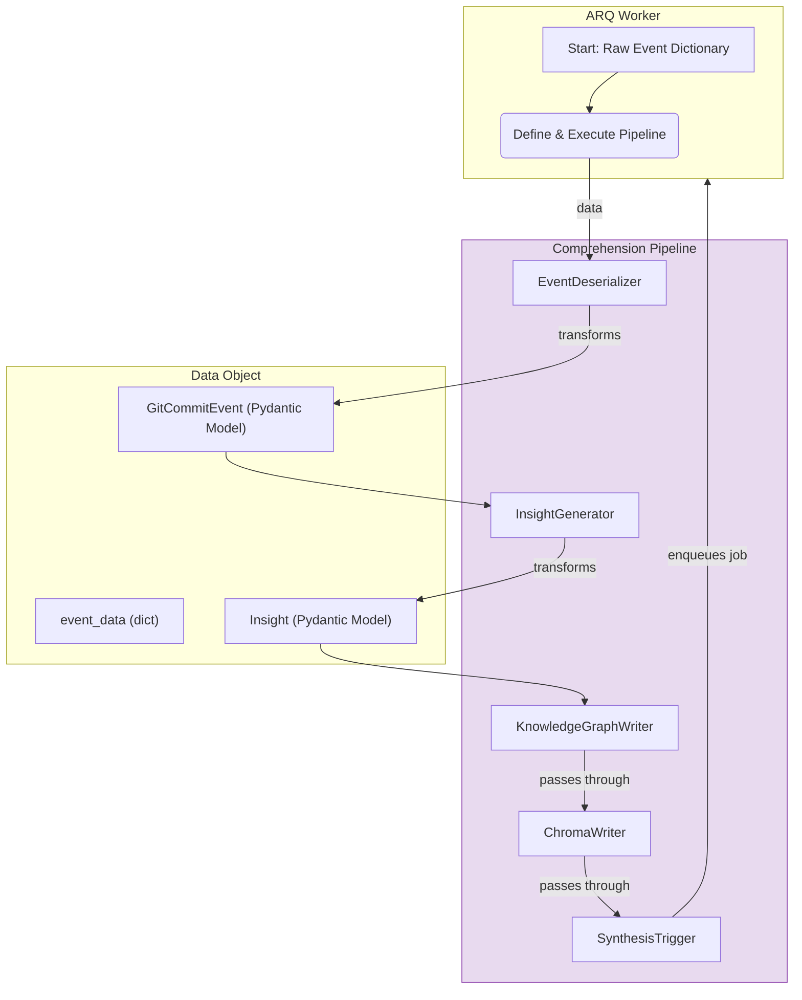

# Cortex Mentor Architecture

This document outlines the architecture of the Cortex Mentor application, a system designed to analyze software development events and provide intelligent insights.

## 1. High-Level Architecture

The Cortex Mentor application is built on a **Hybrid Knowledge Model**, which separates private user data from a public, curated knowledge base. This ensures user privacy while leveraging a powerful cloud-based platform for expert knowledge. The architecture is event-driven and uses a multi-agent system to process and analyze development data.

The core components are:

- **Event-Driven API**: A FastAPI-based API receives events from observers like IDE plugins and Git hooks.
- **Asynchronous Task Queue**: ARQ and Redis manage background jobs for event processing.
- **Hybrid Knowledge Stores**:
    - **Private User Model (Zettelkasten & Search Index)**: This is a dual-component system for storing user-specific data securely on the user's machine.
        - **Markdown Files (Source of Truth)**: The `data/knowledge_graph/` directory contains interlinked markdown files that form the primary, human-readable, and persistent memory of the mentor's understanding of the user (the "Zettelkasten").
        - **ChromaDB (Search Index)**: A local ChromaDB instance acts as a performance layer, storing vector embeddings of the markdown content. It serves as a high-speed, machine-readable search index, with metadata pointing back to the source markdown files.
    - **Public MCP Knowledge Base**: A cloud-based Upstash Context platform containing curated, high-quality software development knowledge.
- **AI Agent Fleet**:
    - **Level 1 (Comprehension)**: Processes raw events and stores insights in the private user model.
    - **Level 2 (Synthesis)**: Combines insights from both the private user model and the public MCP knowledge base to provide expert advice.
    - **Corpus Curator**: A background agent responsible for populating and maintaining the public MCP knowledge base.
- **Observers**: A collection of local tools that monitor file changes, Git hooks, and IDE events.
 
The following diagram illustrates the Hybrid Knowledge Model architecture:

## 2. Infrastructure

The application is designed for containerized deployment using Docker, ensuring a consistent environment for development and production. The key infrastructure components are:

- **API Server (FastAPI & Uvicorn)**: A high-performance Uvicorn server runs the FastAPI application. FastAPI was chosen for its modern features, asynchronous capabilities, automatic data validation with Pydantic, and interactive API documentation. It serves as the primary entry point for all incoming events.

- **Asynchronous Task Queue (ARQ & Redis)**: ARQ is used for its simplicity, high performance, and native `asyncio` support. It manages background tasks like event processing and knowledge curation. Redis acts as the message broker for ARQ, providing a robust and scalable foundation for the task queue.

- **Private Knowledge Store (ChromaDB & Ollama)**:
    - **ChromaDB**: A local, persistent ChromaDB instance is used as the vector store for the private user model. It was chosen for its ease of use, file-based storage, and efficient semantic search capabilities, making it ideal for running on a user's local machine.
    - **Ollama**: Ollama provides local access to large language models (like `nomic-embed-text`) for generating text embeddings. This allows all user data and embeddings to remain entirely on the user's machine, ensuring maximum privacy.

- **Public Knowledge Store (Upstash)**: Upstash is a serverless data platform that provides a managed vector database. It was chosen for the public MCP Knowledge Base due to its scalability, ease of use, and pay-as-you-go pricing, making it a cost-effective solution for storing and querying curated, expert knowledge.

- **CI/CD (GitHub Actions)**: The `.github/workflows/python-app.yml` file defines a continuous integration pipeline using GitHub Actions. This pipeline automates the process of installing dependencies, running tests, and linting the codebase on every push, ensuring code quality and stability.

## 3. Code Details

The application's code is organized into a modular structure within the `src/cortex` directory, promoting separation of concerns and maintainability.

- **`main.py`**: The main entry point of the FastAPI application. It initializes the app, sets up the lifespan events (like creating the Redis pool), and includes the API routers.

- **`api/events.py`**: Defines the API endpoints for receiving events. It handles incoming HTTP requests, validates the event data using Pydantic models, and enqueues the events as jobs in the ARQ task queue.

- **`workers.py`**: Configures the ARQ worker settings. It defines the tasks that the workers can execute (e.g., `process_event_task`, `curate_corpus_task`) and maps them to specific queues (e.g., `high_priority`, `low_priority`).

- **`core/`**: Contains the core application logic and configuration.
    - `config.py`: Manages application settings using Pydantic's `BaseSettings`, allowing for configuration via environment variables.
    - `redis.py`: Handles the creation and lifecycle of the Redis connection pool for the ARQ task queue.

- **`models/events.py`**: Defines the Pydantic models for the event data structures, ensuring that all incoming data is well-formed and validated.

- **`services/`**: Contains the service classes that provide an abstraction layer for interacting with external data stores.
    - `chroma_service.py`: Manages all interactions with the local ChromaDB instance, including adding documents and querying for similar insights.
    - `upstash_service.py`: Manages all interactions with the Upstash Vector DB, handling the public MCP Knowledge Base.

- **`agents/`**: Contains the AI agents that perform the core logic of the application.
    - `level1_comprehension.py`: The Level 1 agent processes raw events, generates human-readable insights, and performs the dual-write to the Markdown Knowledge Graph and the ChromaDB index.
    - `level2_synthesis.py`: The Level 2 agent queries both the private and public knowledge stores to synthesize higher-level insights and form expert opinions.
    - `level3_curation/corpus_curator.py`: The Corpus Curator agent is responsible for curating and populating the public MCP Knowledge Base in the background.

## 6. Refactoring to a Pipeline & Processor Model

To create a more modular, scalable, and testable system, the current agent-based logic will be refactored into a formal **Pipeline & Processor** architecture. In this model, a "Pipeline" is responsible for executing a series of self-contained, reusable "Processors," with each processor handling one specific unit of work.

This approach decouples the logic, allowing for flexible composition of workflows and easier maintenance. The ARQ task will be simplified to just defining and executing the appropriate pipeline.

### Flow Description:

1.  **Execution**: An ARQ task receives the raw event data and constructs a `Pipeline` composed of specific processors.
2.  **Processing**: The pipeline executes the processors in sequence:
    *   `EventDeserializer`: Parses the raw dictionary into a validated Pydantic `Event` model.
    *   `InsightGenerator`: Takes the `Event` model, calls the `LLMService`, and produces a structured `Insight` object.
    *   `KnowledgeGraphWriter`: Appends the human-readable insight to the Markdown knowledge graph.
    *   `ChromaWriter`: Adds the machine-readable embedding to the ChromaDB index.
    *   `SynthesisTrigger`: Enqueues a new job for the next pipeline (e.g., the Synthesis Pipeline).
3.  **Data Flow**: The output of each processor becomes the input for the next, allowing data to be progressively enriched and transformed as it moves through the pipeline.
